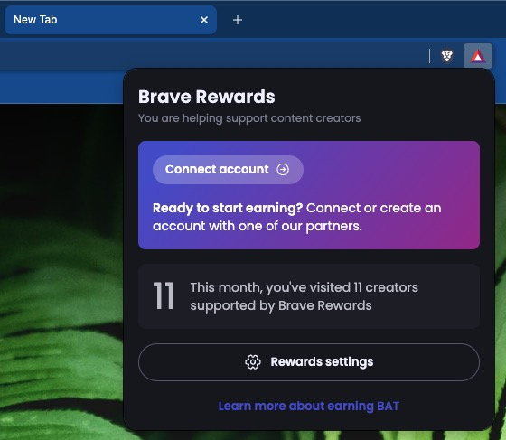

[Brave Browser](https://brave.com/) is a Chromium fork focused on privacy and offering users a rewards program to earn crypto tokens called BAT or Basic Attention Token in exchange to viewing ads in various places. I use it for development to have access to Chrome's dev tools and compatibility, and personal use when I need a Chromium-based browser.

Before we get to far, there are a few things I'd like to clarify: I am not bullish on crypto. I am not affiliated with Brave. No one paid me to write this.

However, I like the concept of opt-in revenue-sharing with users and allowing users to choose how they see ads. I also like the concept of automatically contributing to websites based on usage. Brave decided to pursue those ideas using a token, so, I figured I'd give it a try on this website.

With that out of the way, here's what is involved in being a Brave "Creator":

Some notable sites I've noticed are BAT-certified:

- [AlternativeTo](https://alternativeto.net/)
- [freeCodeCamp](https://www.freecodecamp.org/)
- [KhanAcademy](https://www.khanacademy.org/)
- [Material UI](https://mui.com/)
- [Preact](https://preactjs.com/)
- [Tor](https://www.torproject.org/)
- [Qwant](https://www.qwant.com/)
- [Wikipedia](https://en.wikipedia.org/)
- [Web Archive](https://web.archive.org/)

According to Brave, I've visited 11 sites supported by Brave Rewards this month:

I don't mind sponsored splash screens on new tabs. Brave seems to do a good job of keeping things aesthetically pleasing.
