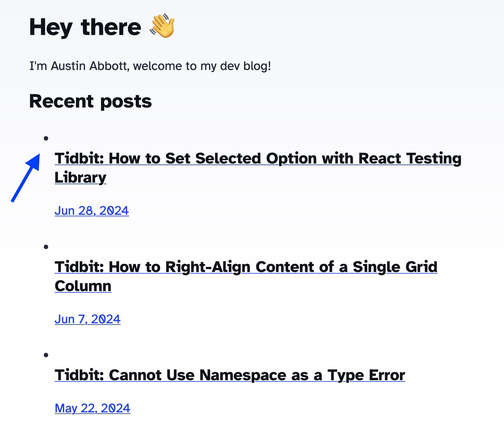

#### Problem

In Firefox, when a clickable element such as `<a>` or `<button>` is rendered inside of a `<li>` element, Firefox renders the content below the bullet instead of adjacent to it.

#### Solution

You can fix misaligned bullet points in Firefox by wrapping the clickable element in a block-level element, like a `<div>`

#### Example



#### Code fix

```
<section>
    <h4>Recent posts</h4>
    <div>
        <ul>
        {
            posts.map((post) => (
            <li>
                {/* div prevents misaligned bullets in Firefox */}
                <div>
                <a href={`/blog/${post.slug}/`}>
                    <h5 class="title">{post.data.title}</h5>
                    <p class="date">
                    <FormattedDate date={post.data.pubDate} />
                    </p>
                </a>
                </div>
            </li>
            ))
        }
        </ul>
    </div>
</section>
```

Happy Friday!

Header photo by <a href="https://unsplash.com/@rubaitulazad?utm_content=creditCopyText&utm_medium=referral&utm_source=unsplash">Rubaitul Azad</a> on <a href="https://unsplash.com/photos/logo-4xmVvHRioKg?utm_content=creditCopyText&utm_medium=referral&utm_source=unsplash">Unsplash</a>
