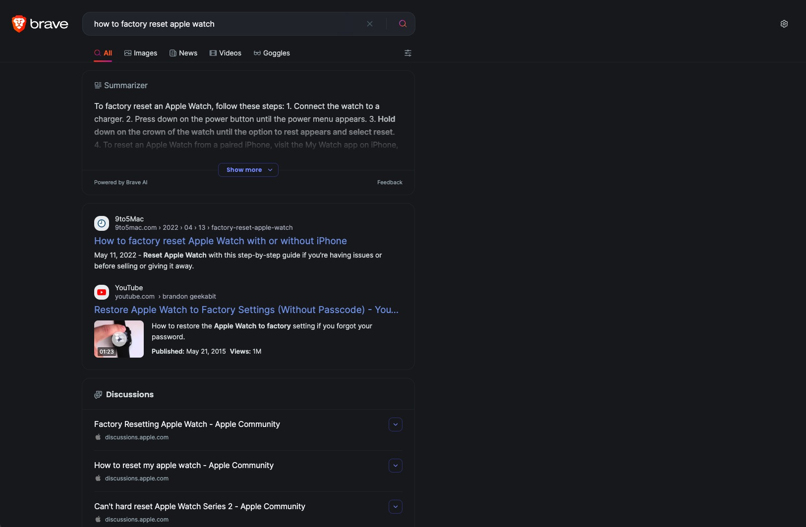
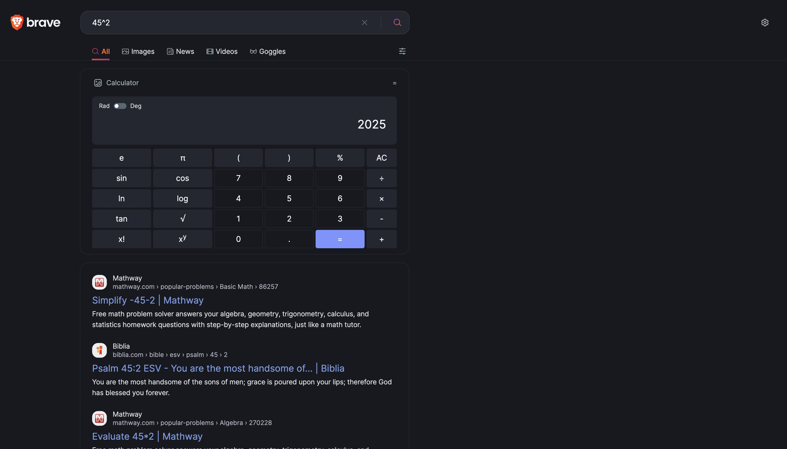
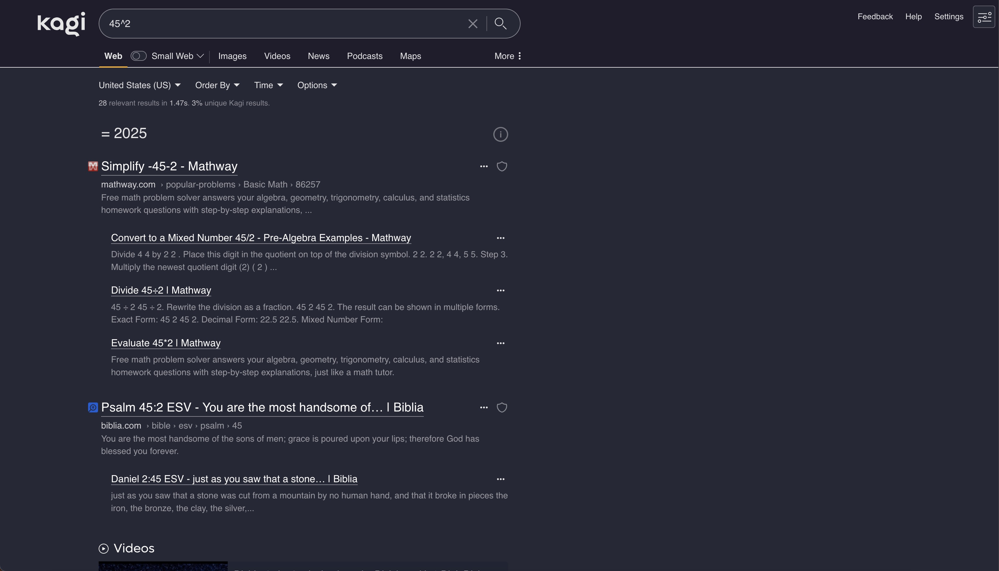

I keep hearing about Kagi, so I decided to pay for unlimited searches for a month ($10 at the time of this article) and compare it to Brave Search. I currently use the free tier of Brave Search, but the only difference between the free and pair tier is ads in the search results or not.

#### Settings I changed from default:

 

##### Brave:

- Enabled [Google Fallback Mixing](https://search.brave.com/help/google-fallback)
  - Considering Kagi uses a variety of sources, it seemed fair to enable Google Fallback Mixing for Brave. Again, this is an opinionated review.

##### Kagi:

- Used Personalized Results to raise/lower some websites:

Raised:

- [Realtor](https://realtor.com/)

Lowered:

- [Forbes](forbes.com)

 

## Category: Day-to-day Searching

 

#### Query: how to factory reset Apple Watch

 

##### Brave Search

##### Kagi

#### Winner: Kagi

I like that Kagi displayed an official guide from Apple first, that's what I'm typically looking for when resetting a device.

## Category: Math

 

#### Query: 45^2

 

##### Brave Search

##### Kagi

#### Winner: Brave

Both gave the correct answer, but I like having an embedded calculator so I can easily build on my original calculation.
