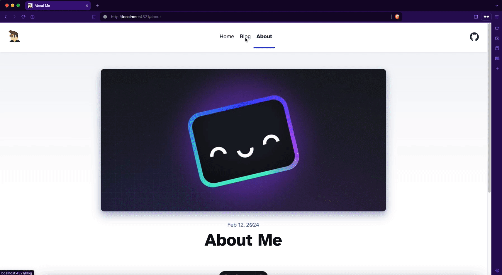

Okay, it's probably a bit late in the year to be using that title, but hey, better late than never?

#### Why Astro?

My reason for using Astro is a bit free spirited (for me).

Last summer, I wanted to build a doc site for my Astro Van pet project. I had used Gatsby for previous projects, but wasn't head over heels for it, so I looked around at other static site generators and content-focused frameworks, which led me to Astro. Given the name matched the model of my van, I had to give it a go, and launched [astrovan.info](https://astrovan.info/). In the process, I found Astro to be lightweight, straightforward to work with, and, best of all, well-documented.

Now, here's how easy it is to get one of these Astro blogs off the ground...

#### Install Astro's CLI

```
npm create astro@latest
```

Side note: Astro's CLI might be the best CLI I've ever used. It makes setting up a project crazy easy.

#### Pick a Theme, Any Theme

If you opt to use one of [Astro's prebuilt themes](https://astro.build/themes/) like I did, all you need to do is run the `create` command with the name of the template, like so:

```
npm create astro@latest -- --template blog
```

I chose one of Astro's official themes, since I knew I'd want to style things my way and was really just looking for a baseline to get started.

#### Fire It Up!

The Astro CLI will tell you this as well, but all you need to do is `cd` into the project directory and run:

```
npm run dev
```

Your project will be live at `localhost:3000`, or `localhost:4321` if you're running the latest version of Astro.

#### Transitions (Optional)

I saw an early blog post from Astro featuring their transitions for the [View Transitions API](https://developer.mozilla.org/en-US/docs/Web/API/View_Transitions_API) and knew I had to have that on my site. So before anything else, I implemented `<ViewTransitions />` in a shared component so all navigation had that slick feel.

Before:



After:


Note: Only Chrome supports the View Transitions API at this point, so the site uses the original navigation style in Safari and Firefox.

#### Deploy!

There’s no shortage of places to host a static website, but Cloudflare’s offering was especially compelling as they offer free, privacy-respecting analytics. I tested it out using my Astro Van website, and found it straightforward to use, so I stuck with that for this site.

All you have to do is link up Cloudflare Pages and your repo on Github and Cloudflare will automatically deploy when changes are pushed or merged. It's a fantastic combo once the initial setup is done. Write markdown, commit, push, done.

Cloudflare already has a guide on deploying an Astro project, so instead of rewriting the book, I'll just link to it [here](https://developers.cloudflare.com/pages/framework-guides/deploy-an-astro-site/).

And that's a wrap!
