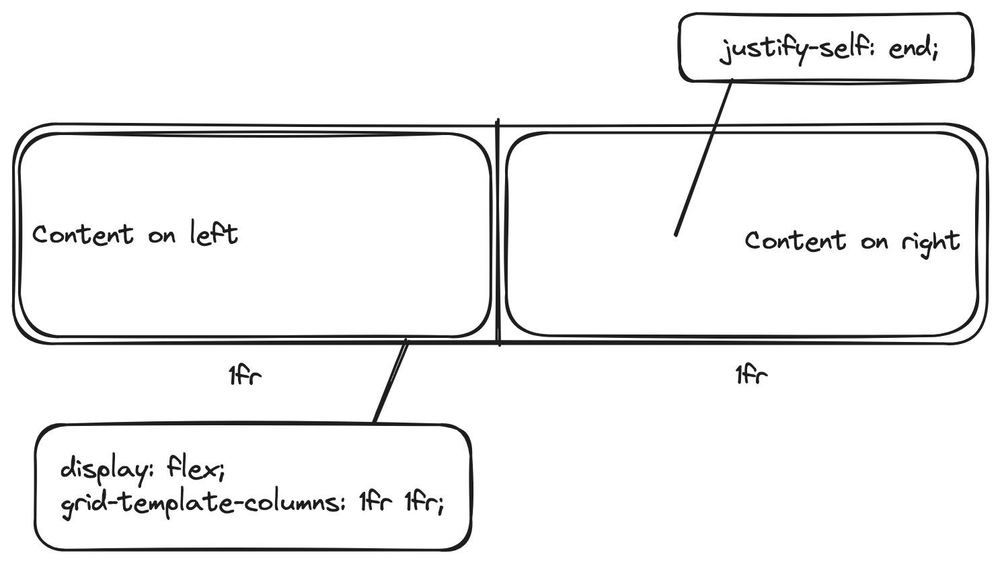

I always end up searching for this online, so adding a quick tidbit to save myself time down the road.

Using `display: grid` and `grid-template-columns: 1fr 1fr` is an easy way to have the content of the first column left-aligned, with the content of the second right-aligned:

```
.parent {
    display: grid;
    grid-template-columns: 1fr 1fr;
}

.right-column {
    justify-self: end;
}
```

Visual example:


<small>Sidenote: the diagram above should say `display: grid` not `display: flex`, but I don't feel like re-writing it</small>

No `text-align` required. Happy Friday! 🍺
